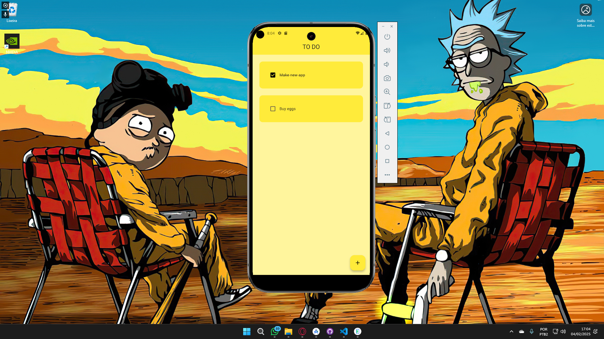
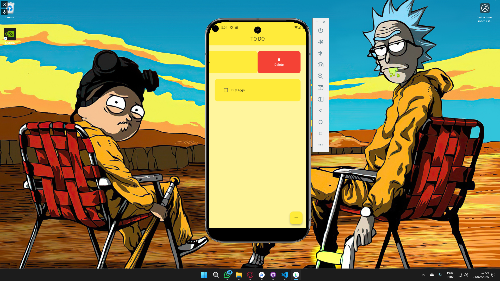
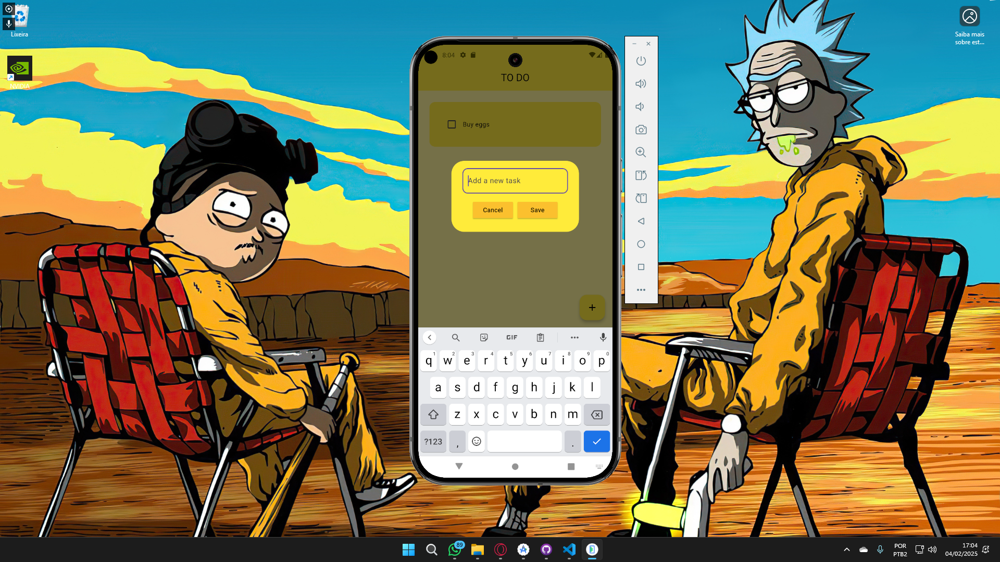

# To-Do App

## Descrição
Este é um aplicativo simples de lista de tarefas desenvolvido em Flutter. Ele permite que os usuários criem, excluam e marquem tarefas como concluídas, oferecendo uma interface minimalista e intuitiva para a gestão de afazeres diários.

## Recursos
- Adicionar novas tarefas
- Marcar tarefas como concluídas
- Excluir tarefas da lista
- Interface simples e responsiva
- Persistência de dados local com Hive

## Tecnologias Utilizadas
- Flutter
- Dart
- Provider (para gerenciamento de estado)
- Hive (para armazenamento local)

## Instalação
1. Clone este repositório:
   ```sh
   git clone https://github.com/fiorellizz/to_do_flutter_app.git
   ```
2. Acesse o diretório do projeto:
   ```sh
   cd to_do_flutter_app
   ```
3. Instale as dependências:
   ```sh
   flutter pub get
   ```
4. Execute o aplicativo:
   ```sh
   flutter run
   ```

## Capturas de Tela

### 📱 Tela Inicial


### ✅ Tarefas Concluídas


### 🗑️ Excluindo uma Tarefa


### ✏️ Adicionando uma nova Tarefa


## Contribuição
Contribuições são bem-vindas! Siga os passos abaixo para contribuir:
1. Faça um fork do repositório.
2. Crie uma nova branch:
   ```sh
   git checkout -b minha-feature
   ```
3. Faça as alterações desejadas e commit:
   ```sh
   git commit -m "Minha nova feature"
   ```
4. Envie suas alterações:
   ```sh
   git push origin minha-feature
   ```
5. Abra um Pull Request.

## Licença
Este projeto está licenciado sob a MIT License - veja o arquivo [LICENSE](LICENSE) para mais detalhes.